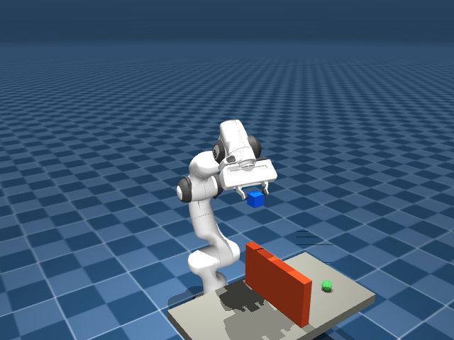
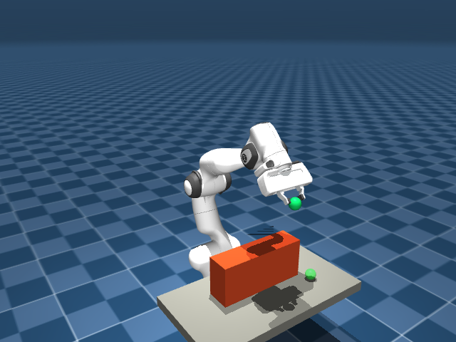
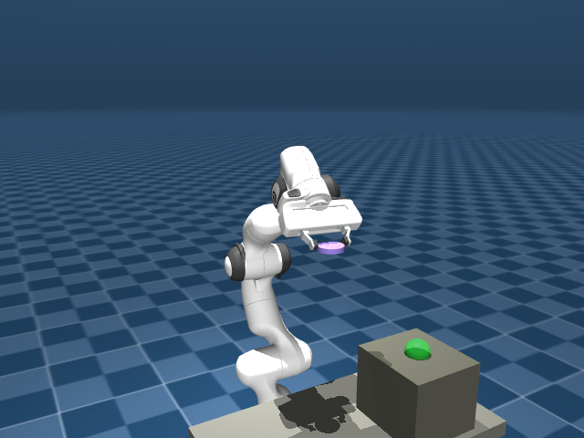

# Cube MorphTAMP-X v2

<!-- AUTO-GENERATED by tools/update_readme.py. Do not edit generated sections by hand. -->

Cube MorphTAMP-X v2 is the clean MuJoCo / Franka Panda prototype for your current
research direction: task-aware arm morphology optimization with object-specific
grasp planning, reachability, singularity-aware IK evidence, collision checks,
and visual replay.

The project is intentionally separate from the older `reachability_morphology_lab`
prototype. Treat this folder as the current baseline.

## What this project does

The closed loop is:

1. choose an object and task scene;
2. generate multiple grasp candidates for that object;
3. score candidates using IK error, orientation error, joint margin, collision,
   7D joint path length, max joint step, and condition number;
4. replay the selected plan with a real 7-DOF Franka/Panda MuJoCo model;
5. optionally compare all grasp candidates in a report and switch between their
   individual replays;
6. run object-task and morphology benchmarks for cost / reachability tradeoffs.

Evidence scope: this is a research prototype for reachability, kinematic
feasibility, grasp-candidate selection, collision-aware replay, and morphology
cost comparison. It is not yet a full force-controlled contact manipulation stack.

## Simulation snapshots

These screenshots are generated from MuJoCo replay scenes with the Franka/Panda
model and object-specific grasp planning. Regenerate them with
`python tools/render_readme_screenshots.py --panda-xml ~/robocasa/mujoco_menagerie/franka_emika_panda/scene.xml`.

| Cube over barrier | Sphere folded transfer | Plate shelf place |
|---|---|---|
|  |  |  |
| Solid-obstacle transfer with selected Panda replay. | Folded arm posture while carrying a sphere. | Object-specific grasp selection for plate-style placement. |

## Environment

From WSL:

```bash
cd ~/robocasa/cube_morphtamp_x_v2
conda activate robocasa
export PYTHONPATH=src:tools
```

Recommended Franka/Panda model:

```bash
~/robocasa/mujoco_menagerie/franka_emika_panda/scene.xml
```

If you open an interactive viewer, use:

```bash
MUJOCO_GL=glfw
```

## Keep this README updated

This README is generated from the code registries for objects, tasks, and arm
designs. After changing CLI behavior, object definitions, task definitions, or
morphology presets, run:

```bash
python tools/update_readme.py
python -m pytest -q tests/test_readme_sync.py
```

The test fails if `README.md` is stale, so normal test runs will remind you to
regenerate it after code changes.

## Quick health check

```bash
python -m pytest -q tests

python -m morphtamp_x_v2.cli list-objects
python -m morphtamp_x_v2.cli list-tasks
python -m morphtamp_x_v2.cli check-tasks
```

## CLI command reference

| Command | Purpose |
|---|---|
| `analyze-benchmark` | summarize benchmark JSON to JSON/CSV/Markdown |
| `benchmark` | evaluate object/task combinations |
| `browse` | interactive object/task switching viewer |
| `browse-candidates` | interactive switching viewer for grasp candidates |
| `build-scene` | write a MuJoCo Panda/object/task scene XML |
| `check-tasks` | validate object/task library geometry |
| `compare-grasps` | rank grasp candidates and generate per-candidate replays |
| `design-analysis` | generate Pareto, segment-importance, and recommendation reports |
| `failure-analysis` | summarize failed cases by design, object, task, and reason |
| `list-objects` | print available object types |
| `list-tasks` | print available task types |
| `morphology-benchmark` | evaluate morphology designs over object/task cases |
| `optimize-morphology` | search continuous morphology scales for lowest feasible cost |
| `plan` | generate symbolic pick-place phases |
| `robustness-benchmark` | evaluate seed/pose perturbation robustness |
| `run` | select a grasp, build scene, solve Panda replay, and write replay JSON |
| `validate-physics` | run replay-level physics validation |
| `view` | open or report a generated replay |
| `visualize-results` | generate benchmark and morphology figures |

## Single task run

Generate one selected plan and replay:

```bash
python -m morphtamp_x_v2.cli run \
  --object cube \
  --task over_barrier \
  --panda-xml ~/robocasa/mujoco_menagerie/franka_emika_panda/scene.xml \
  --auto-fit-panda \
  --position-tolerance 0.035 \
  --full-candidate-limit 2 \
  --output-dir results/cube_over_barrier_current
```

Visualize the replay:

```bash
MUJOCO_GL=glfw python -m morphtamp_x_v2.cli view \
  --xml results/cube_over_barrier_current/scene.xml \
  --replay results/cube_over_barrier_current/replay.json \
  --interactive \
  --fps 60 \
  --playback-speed 0.55
```

## Compare grasp candidates

Generate a candidate comparison report and one independent replay per grasp
candidate:

```bash
python -m morphtamp_x_v2.cli compare-grasps \
  --object plate \
  --task shelf_place \
  --panda-xml ~/robocasa/mujoco_menagerie/franka_emika_panda/scene.xml \
  --auto-fit-panda \
  --full-candidate-limit 3 \
  --position-tolerance 0.05 \
  --output-dir results/plate_shelf_candidate_comparison
```

Open the report:

```bash
explorer.exe results/plate_shelf_candidate_comparison/candidate_report.html
```

Open the switchable candidate viewer:

```bash
MUJOCO_GL=glfw python -m morphtamp_x_v2.cli browse-candidates \
  --manifest results/plate_shelf_candidate_comparison/candidate_replays/manifest.json \
  --fps 60 \
  --playback-speed 0.55
```

Candidate viewer keys:

- `n` / `d` / `]` / right / up: next candidate
- `p` / `a` / `[` / left / down: previous candidate
- `1`-`9`: jump to candidate
- `r`: replay current candidate
- `h`: help
- `q` / `Esc`: quit

## Interactive object/task browser

Use this when you want to switch tasks and objects without rebuilding commands:

```bash
MUJOCO_GL=glfw python -m morphtamp_x_v2.cli browse \
  --panda-xml ~/robocasa/mujoco_menagerie/franka_emika_panda/scene.xml \
  --auto-fit-panda \
  --objects cube sphere cylinder plate mug_proxy bowl_proxy capsule tall_box flat_box ring \
  --tasks tabletop_easy over_barrier narrow_slot shelf_pick shelf_place folded_transfer diagonal_reach_around \
  --output-dir results/browser_current \
  --fps 60 \
  --playback-speed 0.55
```

Object/task browser keys:

- `o`: next object
- `i`: previous object
- `n` / `]` / up: next task
- `p` / `[` / down: previous task
- `r`: replay current case
- `h`: help
- `q` / `Esc`: quit

## Benchmark

```bash
python -m morphtamp_x_v2.cli benchmark \
  --protocol fixed \
  --objects cube sphere cylinder plate mug_proxy bowl_proxy \
  --tasks tabletop_easy over_barrier narrow_slot shelf_pick shelf_place folded_transfer \
  --panda-xml ~/robocasa/mujoco_menagerie/franka_emika_panda/scene.xml \
  --auto-fit-panda \
  --position-tolerance 0.05 \
  --full-candidate-limit 2 \
  --output results/current_object_task_benchmark.json

python -m morphtamp_x_v2.cli analyze-benchmark \
  --input results/current_object_task_benchmark.json \
  --output-json results/current_benchmark_summary.json \
  --output-csv results/current_benchmark_summary.csv \
  --output-md results/current_benchmark_summary.md
```

The benchmark summary includes:

- `grasp_planning`: coarse/full candidate counts and rejection codes;
- `failure_taxonomy`: task, joint, and grasp failure counts by object/task;
- `task_splits`: development, main, heldout, and unassigned task groups.

Use held-out tasks only after tuning decisions are frozen.

## Morphology benchmark

```bash
python -m morphtamp_x_v2.cli morphology-benchmark \
  --protocol fixed \
  --objects cube sphere cylinder plate mug_proxy bowl_proxy \
  --tasks tabletop_easy over_barrier narrow_slot shelf_pick shelf_place folded_transfer \
  --panda-xml ~/robocasa/mujoco_menagerie/franka_emika_panda/scene.xml \
  --auto-fit-panda \
  --position-tolerance 0.05 \
  --full-candidate-limit 2 \
  --output results/current_morphology_benchmark.json
```

## Continuous morphology optimization

Use this when you want to move beyond the preset design list and search over
segment scales and base placement while enforcing a robust reach margin. For
Panda-aware runs, use `--base-results-cache`; the real Panda IK / Jacobian
base cases are expensive, and the cache makes interrupted runs resumable:

```bash
python -m morphtamp_x_v2.cli optimize-morphology \
  --protocol heldout_fixed \
  --panda-xml ~/robocasa/mujoco_menagerie/franka_emika_panda/scene.xml \
  --scale-values 0.70 0.82 0.90 1.00 1.10 \
  --base-x-values 0.00 0.03 0.05 \
  --minimum-reach-margin 0.05 \
  --minimum-sigma 0.08 \
  --maximum-condition-number 30 \
  --path-cost-weight 0.02 \
  --base-results-cache results/heldout_panda_base_cache.json \
  --output results/heldout_panda_singularity_morphology.json
```

Analyze the resulting design trade-offs:

```bash
python -m morphtamp_x_v2.cli design-analysis \
  --input results/heldout_panda_singularity_morphology.json \
  --output-json results/heldout_panda_design_analysis.json \
  --output-md results/heldout_panda_design_analysis.md
```

## Robustness benchmark

Use this after a fixed benchmark passes to test whether the result survives
small pose and obstacle perturbations. Panda-aware robustness is expensive, so
use `--results-cache` for resumable overnight runs. The cache is trial-indexed:
you can run 5 trials first, then rerun with 10 or 20 trials and the completed
rows will be reused as long as the objects, tasks, seed, perturbation settings,
Panda XML, candidate limit, and tolerance stay fixed.

```bash
python -m morphtamp_x_v2.cli robustness-benchmark \
  --protocol heldout_fixed \
  --panda-xml ~/robocasa/mujoco_menagerie/franka_emika_panda/scene.xml \
  --trials 5 \
  --seed 42 \
  --position-noise 0.01 \
  --obstacle-noise 0.01 \
  --position-tolerance 0.05 \
  --full-candidate-limit 1 \
  --results-cache results/heldout_panda_robustness_full_cache.json \
  --output results/heldout_panda_robustness_full.json
```

The robustness JSON now contains a report-ready `summary` block with:

- overall success rate and failed-run entries;
- maximum and mean position error;
- minimum and mean Panda Jacobian singular value;
- maximum and mean condition number;
- mean path length;
- by-object and by-task success tables.

## Failure analysis

Turn any benchmark-like JSON containing a `results` list into a compact failure
taxonomy. Static task failures are reported with a `task:` prefix, and Panda /
Franka joint-replay failures are reported with a `joint:` prefix so IK,
collision, singularity, and reach-margin causes do not get mixed together:

```bash
python -m morphtamp_x_v2.cli failure-analysis \
  --input results/current_morphology_benchmark.json \
  --output-json results/current_failure_analysis.json \
  --output-md results/current_failure_analysis.md
```

## Figures

```bash
python -m morphtamp_x_v2.cli visualize-results \
  --benchmark results/current_object_task_benchmark.json \
  --morphology results/current_morphology_benchmark.json \
  --output-dir results/current_figures

explorer.exe results/current_figures/dashboard.html
```

Always check:

```bash
results/current_figures/visualization_manifest.json
```

Look at `data_quality.warnings` before using figures in a report.

## Final evidence and report artifacts

For the current Panda-aware held-out result package, the tracked compact evidence
file is:

```bash
evidence/heldout_panda_final_summary.json
```

The current report-style results chapter is:

```bash
docs/results/panda_heldout_final_report.md
```

The full raw experiment outputs are intentionally kept under the untracked
`results/` directory. When syncing this repository to WSL, exclude only the
root result directory with an anchored rule such as `/results/`; do not use a
bare `results/` exclude, because that can also skip tracked documentation paths
like `docs/results/`.

## Object library

| Object | Geometry | Size | Description |
|---|---:|---:|---|
| `cube` | `box` | `0.02, 0.02, 0.02` | box object; side pinch with flat finger pads |
| `sphere` | `sphere` | `0.022` | round object; symmetric center pinch |
| `cylinder` | `cylinder` | `0.018, 0.035` | upright cylinder/cup proxy; side pinch near mid-height |
| `plate` | `cylinder` | `0.032, 0.006` | thin plate/tray proxy; edge-sensitive shallow grasp |
| `mug_proxy` | `cylinder` | `0.024, 0.04` | mug/cup body proxy; side grasp on cylindrical body |
| `bowl_proxy` | `sphere` | `0.03` | small bowl proxy; broad symmetric side grasp |
| `capsule` | `capsule` | `0.016, 0.05` | capsule/handle proxy; elongated side grasp |
| `tall_box` | `box` | `0.018, 0.018, 0.05` | tall box proxy; tests height clearance and wrist posture |
| `flat_box` | `box` | `0.04, 0.026, 0.008` | flat object proxy; tests low-profile pick and accurate placement |
| `ring` | `cylinder` | `0.026, 0.01` | ring proxy represented as a thin cylinder; tests small target transfer |

## Task library

| Task | Start xy | Target xy | Obstacle | Motion style | Description |
|---|---:|---:|---:|---:|---|
| `tabletop_easy` | `(0.42, -0.08)` | `(0.48, 0.08)` | no | `direct` | short unobstructed tabletop transfer |
| `long_transfer` | `(0.36, -0.18)` | `(0.56, 0.18)` | no | `direct` | larger lateral displacement to stress reach and smoothness |
| `high_to_low` | `(0.4, -0.1)` | `(0.5, 0.12)` | no | `direct` | pick from elevated block and place on lower table |
| `low_to_high` | `(0.4, -0.12)` | `(0.52, 0.1)` | no | `direct` | place onto elevated block/shelf proxy |
| `over_barrier` | `(0.4, -0.22)` | `(0.52, 0.22)` | yes | `direct` | carry object over a mid-height obstacle between start and target |
| `narrow_slot` | `(0.4, -0.12)` | `(0.48, 0.13)` | yes | `direct` | target near a narrow slot proxy; emphasizes placement accuracy |
| `shelf_pick` | `(0.38, -0.16)` | `(0.5, 0.12)` | no | `direct` | pick object from a raised shelf block and place on table |
| `shelf_place` | `(0.4, -0.14)` | `(0.52, 0.16)` | no | `direct` | place object onto an elevated shelf block |
| `far_corner` | `(0.34, -0.24)` | `(0.62, 0.24)` | no | `direct` | large diagonal transfer to stress reachability and joint limits |
| `under_bridge` | `(0.4, -0.2)` | `(0.52, 0.2)` | yes | `direct` | move below a low bridge; tests clearance control |
| `around_wall` | `(0.38, -0.2)` | `(0.56, 0.2)` | yes | `direct` | transfer around/over a vertical wall proxy |
| `precision_drop` | `(0.4, -0.12)` | `(0.5, 0.08)` | no | `direct` | small target pad; emphasizes placement precision |
| `near_to_far_reach` | `(0.34, -0.1)` | `(0.64, 0.1)` | no | `extend` | near-body pick followed by a deliberate far reach extension |
| `far_to_near_retract` | `(0.64, -0.1)` | `(0.34, 0.1)` | no | `retract` | far pick followed by retraction toward the robot base |
| `folded_transfer` | `(0.58, -0.18)` | `(0.56, 0.2)` | yes | `fold_then_extend` | force a visible fold-near-body waypoint before extending back out |
| `compound_shelf_barrier` | `(0.38, -0.22)` | `(0.6, 0.22)` | yes | `compound` | compound high shelf transfer over a solid mid-height barrier |
| `diagonal_reach_around` | `(0.35, -0.25)` | `(0.65, 0.25)` | yes | `compound` | diagonal transfer around a vertical wall while placing back on the table |

## Morphology design library

| Design | Upper | Forearm | Wrist | Base shift | Description |
|---|---:|---:|---:|---:|---|
| `short_arm` | 0.82 | 0.82 | 0.9 | (0.0, 0.0, 0.0) | low-cost compact arm |
| `nominal_panda` | 1 | 1 | 1 | (0.0, 0.0, 0.0) | reference Franka/Panda dimensions |
| `long_forearm` | 1 | 1.18 | 1 | (0.0, 0.0, 0.0) | forearm-biased reach extension |
| `long_wrist` | 1 | 1 | 1.22 | (0.0, 0.0, 0.0) | wrist-biased dexterity extension |
| `high_reach_arm` | 1.12 | 1.12 | 1.05 | (0.0, 0.0, 0.0) | longer arm for shelf / high tasks |
| `compact_base_shift` | 0.92 | 0.92 | 0.95 | (0.05, 0.0, 0.0) | compact arm with small base placement change |

## Common output files

- `replay.json`: selected plan, static replay frames, and optional Panda joint replay.
- `scene.xml`: generated MuJoCo scene for a replay.
- `candidate_report.html`: visual explanation of candidate ranking.
- `candidate_replays/manifest.json`: switchable candidate replay index.
- `visualization_manifest.json`: figure output manifest and data-quality warnings.

## Troubleshooting

- If interactive rendering fails in WSL, run with `MUJOCO_GL=glfw`.
- If a viewer says `replay JSON does not contain joint_replay`, rerun the command
  with `--panda-xml`.
- If figures look empty, regenerate fresh benchmark JSON with the current code and
  check `data_quality.warnings`.
- If README is stale, run `python tools/update_readme.py`.
